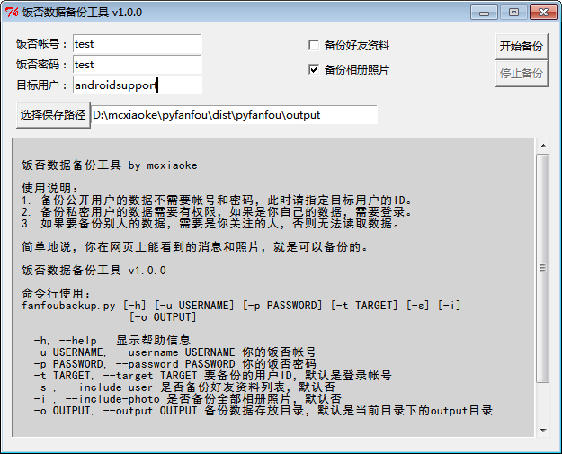
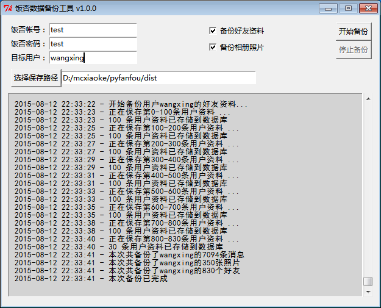
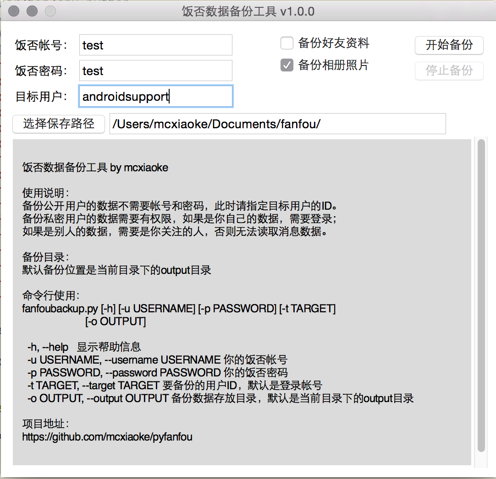
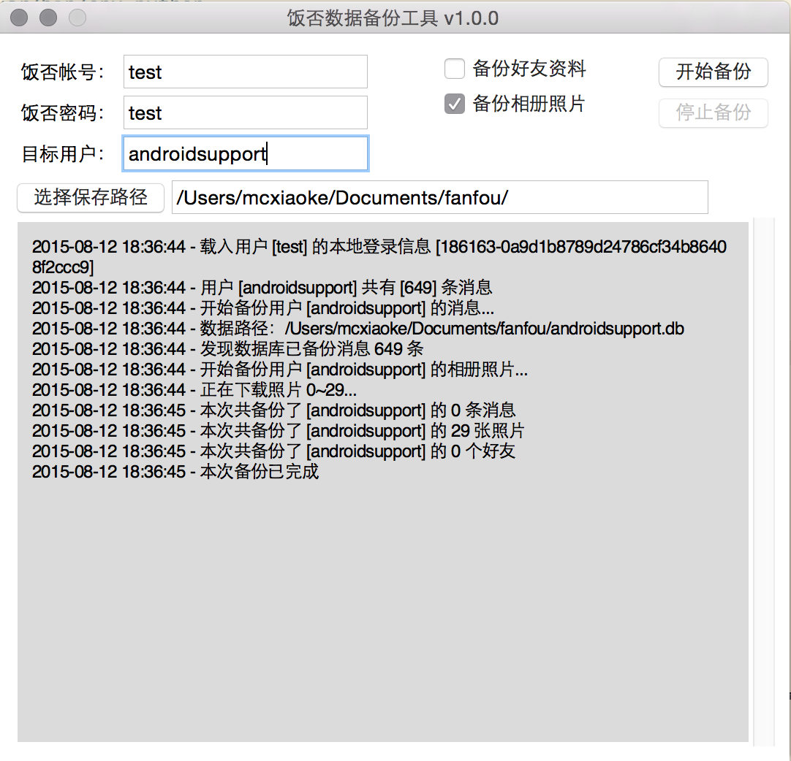

## 饭否数据备份工具

备份指定用户的全部饭否消息，可选备份用户的相册照片和好友资料列表，存储为SQLite3数据库文件，后续将支持导出为HTML/Markdown/PDF

### 安装和使用

#### Windows

在这里下载 [饭否备份工具](https://github.com/mcxiaoke/pyfanfou/releases/latest)，解压，运行目录中的 **pyfanfou.exe** 即可。

### OS X和Linux

使用pip安装：

```
pip install pyfanfou
```

然后终端里：

```
// 使用命令行
fanfoubackup

// 打开GUI界面
fanfoubackupui

```

### 命令行使用

```
fanfoubackup [-h] [-u USERNAME] [-p PASSWORD] [-t TARGET] [-s] [-i]
                 [-o OUTPUT]

  -h, --help   显示帮助信息
  -u USERNAME, --username USERNAME 你的饭否帐号
  -p PASSWORD, --password PASSWORD 你的饭否密码
  -t TARGET, --target TARGET 要备份的用户ID，默认是登录帐号
  -s , --include-user 是否备份好友资料列表，默认否
  -i , --include-photo 是否备份全部相册照片，默认是
  -o OUTPUT, --output OUTPUT 备份数据存放目录，默认是当前目录下的output目录
```

## 截图

#### Windows截图一



#### Windows截图二



#### Mac OS X截图一



#### Mac OS X截图二


